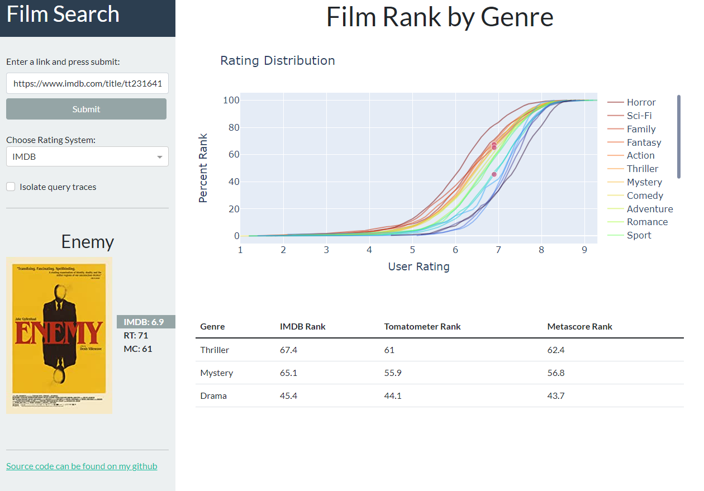
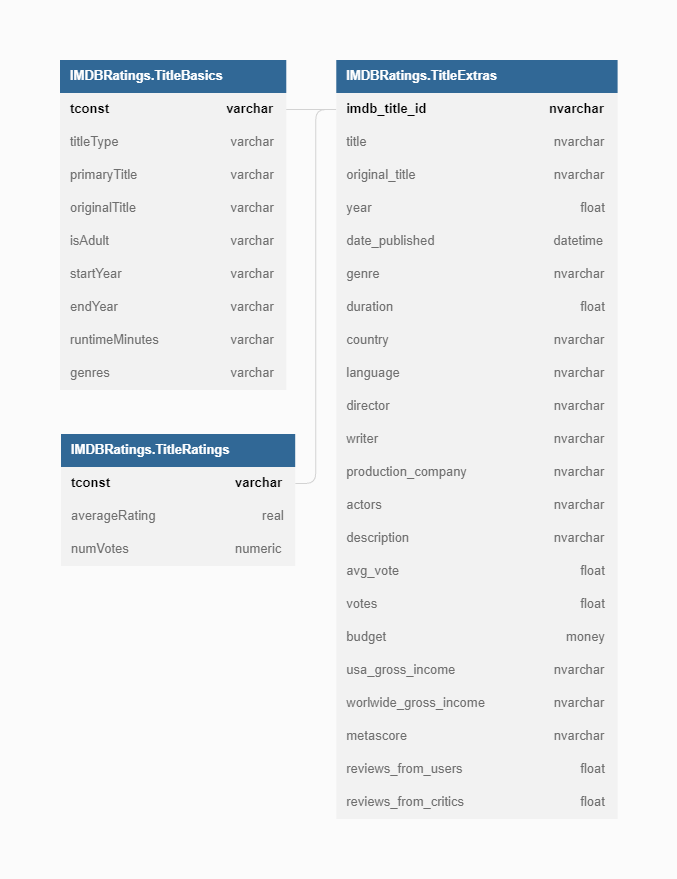

## Film Rank by Genre

### Synopsis

This application takes a chosen film as an input and creates a plot and table describing the rank of the film for the specific genres it is categorized in.

The intent of this project is to compare the average imdb ratings between genres and visualize the distribution of ratings for each genre in an effort to translate a film rating to a genre specific ranking. 

### Data Sources

2 datasets, 2 APIs, and a web crawler comprise the backend data handling for this project:
- [IMDb open dataset](https://www.imdb.com/interfaces/)
- [Stefano Leone's IMDb extensive dataset](https://www.kaggle.com/stefanoleone992/imdb-extensive-dataset)
- [OMDb API](https://www.omdbapi.com/) (Third party API)
- [IMDb-API](https://imdb-api.com/) (Third party API)
- [IMDB website](https://www.imdb.com/) (BS4 web crawling)

### Methods

The tables 'title.basics.tsv', 'title.ratings.tsv' and 'IMDB movies.csv' were loaded into Microsoft SQL Server as TitleBasics, TitleRatings and TitleExtras respectively. These tables were used for exploratory data analysis and subsequent creation of the tables necessary for visualization (OMDb API was used to source the Rotten Tomatoes and Metacritic ratings). The database schema is shown below (created in [dbdiagram.io](https://dbdiagram.io/))

The python package `pyodbc` was then used to load the tables from this database into `pandas` for visualization in `matplotlib` and `plotly`. Dash was used for the frontend of the web application.

