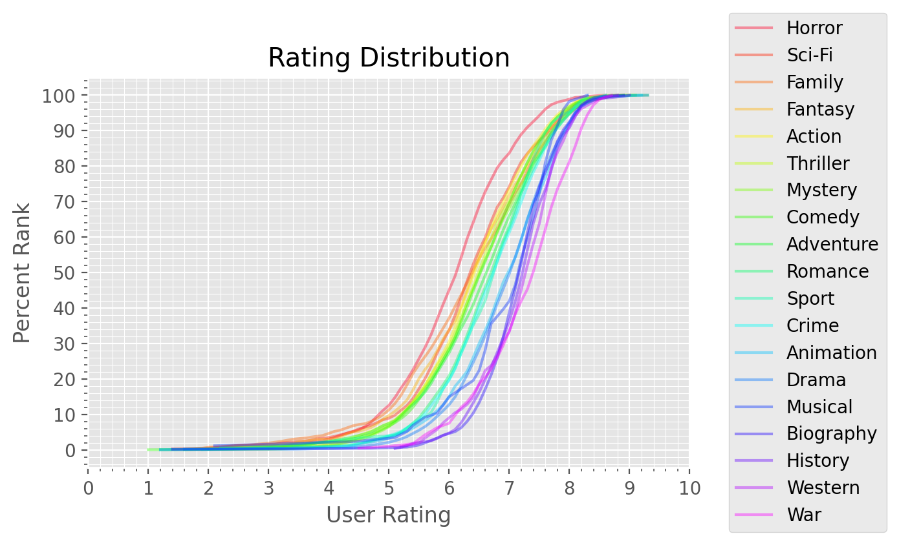

## IMDB Ratings

### Synopsis

The intent of this project is to compare the average imdb ratings between genres and visualize the distribution of ratings for each genre in an effort to translate an IMDB rating to a genre specific ranking. 

The 'title.basics.tsv' and 'title.ratings.tsv' data were sourced from IMDB's openly available [datasets](https://www.imdb.com/interfaces/) and the 'IMDB movies.csv' data was sourced from Stefano Leone's [IMDb extensive dataset](https://www.kaggle.com/stefanoleone992/imdb-extensive-dataset) to categorize films based on country of origin.

### Results

| genre     |   median |   top_20perc |   num_films |
|:----------|---------:|-------------:|------------:|
| Horror    |  6.125   |         6.8  |        1103 |
| Sci-Fi    |  6.356   |         7.2  |         644 |
| Family    |  6.37059 |         7.3  |         420 |
| Fantasy   |  6.4     |         7.3  |         693 |
| Action    |  6.41585 |         7.2  |        2041 |
| Thriller  |  6.48305 |         7.3  |        1458 |
| Mystery   |  6.50278 |         7.4  |         913 |
| Comedy    |  6.52558 |         7.3  |        3244 |
| Adventure |  6.61695 |         7.4  |        1500 |
| Romance   |  6.7     |         7.4  |        1483 |
| Sport     |  6.73333 |         7.4  |         171 |
| Crime     |  6.73429 |         7.4  |        1741 |
| Animation |  6.96471 |         7.7  |         426 |
| Drama     |  7.00262 |         7.6  |        4790 |
| Musical   |  7.15    |         7.6  |          87 |
| Biography |  7.175   |         7.62 |         585 |
| History   |  7.2     |         7.7  |         295 |
| Western   |  7.3     |         7.7  |         105 |
| War       |  7.4     |         8    |         200 |

---

To do:

- ~~Make a table for genres~~
- ~~Create line plots containing each genre~~
- ~~Create table of genre rating means~~
- Create 

### Method

These three tables were loaded into Microsoft SQL Server which was used for exploratory data analysis and subsequent creation of the tables necessary for visualization.

The python package `pyodbc` was then used to load the tables from this database into `pandas` for visualization in `matplotlib`.
